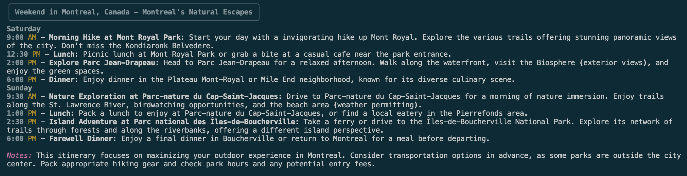

# Weekend Planner Agent Team

An **AI‑powered weekend itinerary planner** built with **Python** and **Google ADK**.  
This project demonstrates **multi‑agent orchestration**: three specialized agents collaborate to transform a free‑form travel query into a structured, two‑day itinerary.
1. Extracts user travel interests
2. Discovers points of interest (POIs)
3. Builds a structured weekend itinerary

---

## ✨ Features

- **Multi‑agent orchestration**: Sequential delegation across three agents
- **Async workflow handling**: Smooth event streaming with robust error handling
- **Colored logging**: Clear, step‑by‑step outputs using [`rich`](https://github.com/Textualize/rich)
- **Professional documentation**: Diagrams, screenshots, and `.env` secrets management
- **Plug‑and‑play demo**: Run `main.py` once and see the full pipeline in action

---

## 🧩 Agent Pipeline Flow

```bash
    User Query --> A1[Retrieve User Interest Agent]
    A1 --> A2[Discovery Agent]
    A2 --> A3[Itinerary Agent]
    A3 --> F[Final Weekend Itinerary]
```
---

## 📂 Project Structure

```
weekend-planner/
├── agents.py          # Defines the three specialized agents
├── runner.py          # Async runner with colored logging
├── main.py            # Entry point for demo execution
├── requirements.txt   # Dependencies
├── .env               # API keys (excluded via .gitignore)
├── docs/
│   └── demo-output.png  # Screenshot of demo run
└── README.md
```
---

## 🚀 Setup

1. **Clone the repo**

```bash
git clone https://github.com/yourusername/weekend-planner.git
cd weekend-planner
```

2. **Install dependencies**

```bash
pip install -r requirements.txt
```

3. **Create a .env file in the project root with your API keys**

```
GOOGLE_API_KEY=your_google_api_key
OPENAI_API_KEY=your_openai_api_key
ANTHROPIC_API_KEY=your_anthropic_api_key
GOOGLE_GENAI_USE_VERTEXAI=False
```
4. **Run the Demo**

```bash
python main.py
```
---

## 🎨 Demo Output
Here’s what the pipeline looks like when you run `python main.py`:



---

## 📜 License

This project is licensed under the MIT License.
